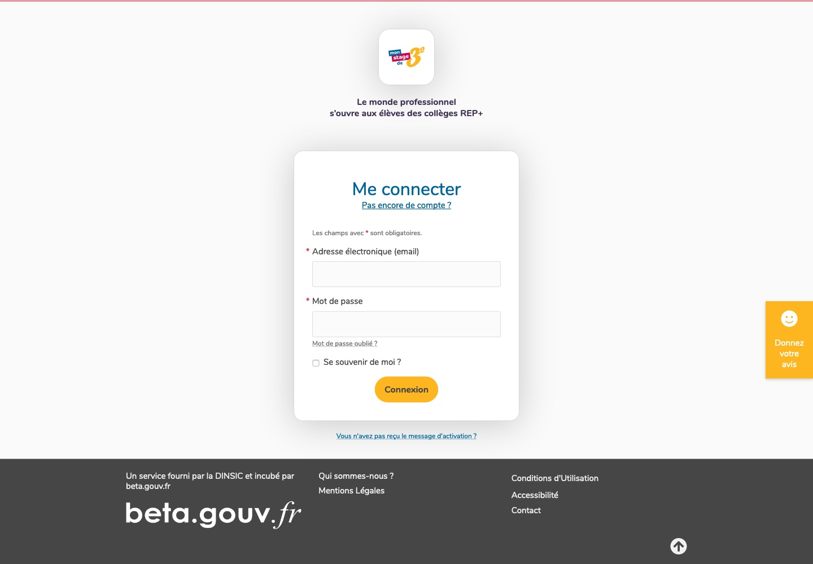
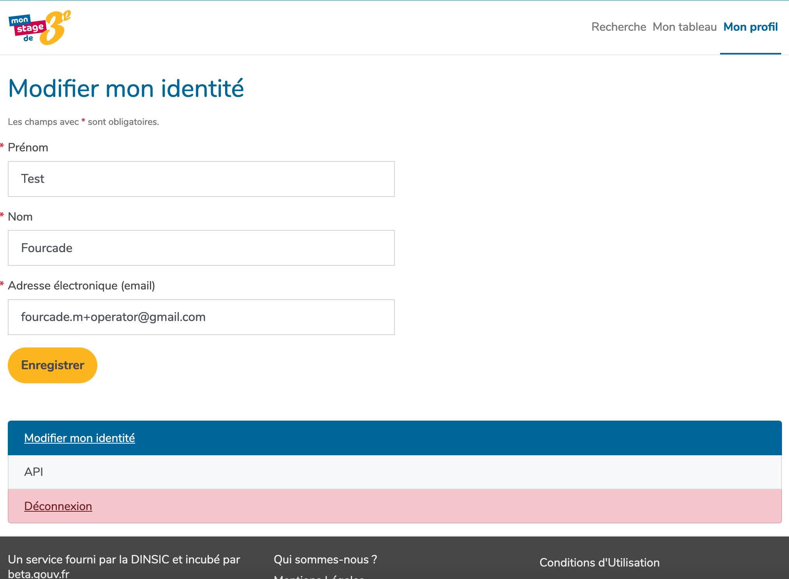
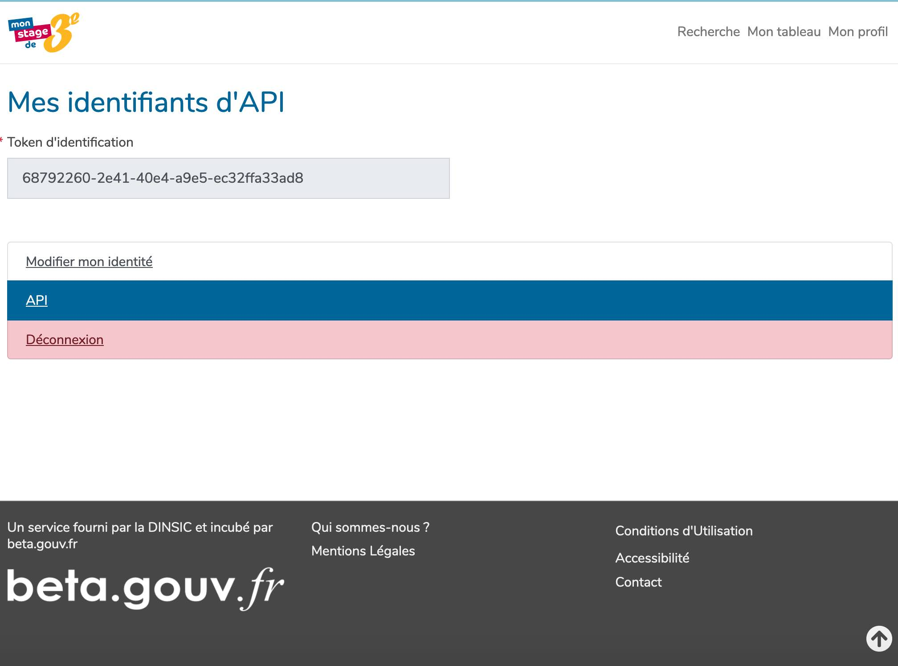

Pour diffuser des offres sur la plateforme "[mon stage de 3e](https://www.monstagedetroisieme.fr/)", une API sera mise à disposition pour :

* les associations
* les collectivités
* les ministères

Il s'agit d'une API REST qui permet les opérations suivantes :
- Ajouter une offre de stage sur Mon stage de 3e
- Modifier une offre de stage sur Mon stage de 3e
- Supprimer une offre de stage sur Mon stage de 3e

# Table des matières
- [Environnements](#environnements)
- [Authentification](#authentification)
- [Structures de données et référentiels](#structures-de-données-et-référentiels)
  - [Offres de stage](#offres-de-stage)
  - [Semaines](#semaines)
  - [Secteurs d'activité](#secteurs-dactivité)
- [Gestion d'erreurs](#gestion-derreurs)
- [Endpoints](#endpoints)
  - [Création d'une offre](#ref-create-internship-offer)
  - [Modification d'une offre](#ref-modify-internship-offer)
  - [Suppression d'une offre](#ref-destroy-internship-offer)
- [Premiers pas et exemples](#premiers-pas-et-exemples)


# Environnements
L'api est disponible sur ```/api``` sur les environnements de pré production et de production. Soit les ```baseURL``` suivantes
  * En pré production : https://v2-test.monstagedetroisieme.fr/api
  * En production : https://www.monstagedetroisieme.fr/api

# Authentification

*Les APIs sont ouvertes uniquement aux acteurs concernés.*

**Merci d'effectuer une demande par mail** ([support](mailto:martin.fourcade@beta.gouv.fr)) pour créer un compte API.

Une fois le compte créé, le token d'API pourra être récupéré via notre interface web. Il est différent selon l'environnement de pré production ou production.

L'authentification se fait par token via le header HTTP : ```Authorization: Bearer #{token} ```

Ce token devra être présent à chaque requête.

### Comment récuperer mon token d'authentification

[Se connecter](https://monstagedetroisieme.fr/users/sign_in) avec votre compte opérateur



Depuis la page [Mon profil](https://www.monstagedetroisieme.fr/account), se rendre sur la page API


Depuis la page [API](https://www.monstagedetroisieme.fr/account/api), récupérer le token


# Structures de données et référentiels

## Offres de stage

Les offres de stages décrits ci-dessous décrivent les offres réservées aux classes de **troisieme**, anciennement nommées troisieme générale

```
{
  internship_offer: {
    title : Titre de l’offre de stage
    description : Description de l'offre de stage

    employer_name : Nom de l’entreprise proposant le stage
    employer_description : Description de l’entreprise proposant le stage
    employer_website : Lien web vers le site de l’entreprise proposant le stage

    coordinates : Coordonnées géographique du lieu du stage
    street : Nom de la rue ou se déroule le stage
    zipcode  : Code postal ou se déroule le stage
    city : Nom de la ville où se déroule le stage

    sector_uuid : Identifiant unique du secteurs, voir référentiel *(1)
    weeks : Liste des semaines pendant lequel celui ci est accessible voir référentiel *(2)

    remote_id: l'identifiant unique du coté operateur|collectivité|association
    permalink: lien de redirection pour renvoyer sur le site unique du coté operateur|collectivité|association
    max_candidates: le nombre de candidat possible sur ce stage
    published_at: date de publication de l'offre
  }
}
```


### <a name="ref-weeks"></a>
## Semaines
Les stages se faisant sur des cycles hebdomadaires de travail (du lundi au vendredi), cette information est codifiée selon la [norme ISO 8601 ](https://fr.wikipedia.org/wiki/Num%C3%A9rotation_ISO_des_semaines).

Exemple : 2019-W35 correspondant à :
* L'année : 2019
* Le numéro de semaine : 35, du 26 août au 1er septembre

Exemple de ce que nous attendons dans nos API :

```
internship_offer.weeks: ["2019-W1", "2019-W3", "2019-W5"]
```

### <a name="ref-sectors"></a>
## Secteurs d'activité

L'API attend en paramètre obligatoire un secteur d'activité associé à une offre. Voici la *liste* ainsi que leurs **identifiants uniques**.

* *Mode*: **b7564ac4-e184-41c4-a7a9-57233a9d244a**
* *Banque et assurance*: **6a8f813b-c338-4d4f-a4cd-99a28748b57d**
* *Audiovisuel*: **4b6427b1-b289-486d-b7ea-f33134995a99**
* *Communication*: **63d73fd3-9ca6-4838-95aa-9901896be99c**
* *Édition, librairie, bibliothèque*: **27c1d368-0846-4038-903f-d63b989e0fe4**
* *Traduction, interprétation*: **1123edde-0d77-498a-85c5-2ab3d81b3cd8**
* *Bâtiment et travaux publics (BTP)*: **ab69287d-273a-4626-b645-d98f567b22ba**
* *Comptabilité, gestion, ressources humaines*: **bfb24e1c-aebc-4451-bb4b-569ab71a814d**
* *Droit et justice*: **1711c7c8-89dc-48dd-9ae9-22bde1bd281b**
* *Enseignement*: **76f3a155-e592-4bb9-8512-358a7d9db313**
* *Recherche*: **c5db692a-2a17-403c-8151-1b3cd7dc48ba**
* *Énergie*: **af7e191a-7065-403e-844d-197e7e1e8bdb**
* *Environnement*: **1bbc6281-805e-4045-b85b-65a1479a865d**
* *Logistique et transport*: **19ccd244-5fac-4ad9-8513-7488d0980f4c**
* *Hôtellerie, restauration*: **92e5ad0c-6e30-43a4-8158-818236d01390**
* *Tourisme*: **dd9d626b-735a-4139-87b8-8c67990b97ba**
* *Agroéquipement*: **0b91687a-f3cc-4cd1-bfb5-b9f03994b1bd**
* *Automobile*: **f3733e9c-f33c-4c33-9903-baf9c8e2d2fb**
* *Construction aéronautique, ferroviaire et navale*: **ee0e9e5c-f19e-4be8-9399-2cff4f4e5ca5**
* *Électronique*: **1ce6aa62-6d91-41e5-9135-ce97e7c94a46**
* *Industrie alimentaire*: **95776212-ddd1-466e-ba5b-089f4e2f11ac**
* *Industrie chimique*: **4974df57-0111-492d-ab60-3bfdad10733d**
* *Maintenance*: **0f51b2d6-91da-4543-a0aa-d49a7be3d249**
* *Mécanique*: **4ee8bd54-7b5b-4ae9-9603-78f303d5aea8**
* *Verre, béton, céramique*: **463578f1-b371-4466-a13f-b0e99f783391**
* *Informatique et réseaux*: **bfd92448-5eae-4d99-ae2c-67fffc8fec69**
* *Jeu vidéo*: **be4bab4d-09ed-4205-bca1-1047da0500f8**
* *Commerce et distribution*: **ae267ff2-76d5-460a-9a41-3b820c392149**
* *Marketing, publicité*: **811621f0-e2d1-4c32-a406-5b45979d7c6d**
* *Médical*: **1aae3b41-1394-4109-83cf-17214e1aefdd**
* *Paramédical*: **89946839-8e18-4087-b48d-e6ee5f7d8480**
* *Social*: **d5a7ec0f-5f9c-44cb-add0-66465b4e7d3c**
* *Sport*: **01d06ada-55be-4ebf-8ad2-2666e7a7f521**
* *Agriculture*: **76de34d3-b524-456d-bc91-92e133cdab2b**
* *Filiere bois*: **aa658f28-a9ac-4a29-976f-a528c994f37a**
* *Architecture, urbanisme et paysage*: **1ee1b11c-97ca-4b7e-a6fb-afe404f24954**
* *Armée - Défense*: **4c0e0937-d7af-4b1c-998c-c1b1d628e3a3**
* *Sécurité*: **ec4ce411-f8fd-4690-b51f-3290ffd069e0**
* *Art et design*: **c1f72076-43fb-44ae-a811-d55eccf15c08**
* *Artisanat d'art*: **1ce60ecc-273d-4c73-9b1a-2f5ee14e1bc6**
* *Arts du spectacle*: **055b7580-c979-480f-a026-e94c8b8dc46e**
* *Culture et patrimoine*: **c76e6364-7257-473c-89aa-c951141810ce**

Exemple de ce que nous attendons donc un uuid dans nos API :

```
internship_offer.sector_uuid: "c76e6364-7257-473c-89aa-c951141810ce"
```

# Gestion d'erreurs
Les erreurs de requête seront signalées via un code HTTP > 400.

Sur chaque requête, on pourra avoir les erreurs suivantes :

- 400, Bad Request : Paramètres de requête mal renseignés. Exemple : Secteur non indiqué dans la création d'une offres
- 401, Unauthorized : Token invalide
- 403, Forbidden : Pas le droit d'effectuer cette requête. Exemple : Modification d'une offre qui ne vous appartient pas
- 422, Unprocessable Entity. Payload incorrect (impossible de traiter la requête car le format ne correspond pas). Ou la donnée n'est pas valide

- 500, Internal Server Error : Service indisponible

En plus de ses erreurs transverses, les erreurs spécifiques à un appel seront détaillées pour chacun d'entre eux.


# Endpoints

#### <a name="ref-create-internship-offer"></a>
## Gestion des offres
### Création d'une offre


**url** : ```#{baseURL}/internship_offers```

**method** : POST

*Paramètres de body :*

* **internship_offer.title** *(string, required)*
* **internship_offer.description** *(text, required *<= 500 caractères)
* **internship_offer.employer_name** *(string, required)*
* **internship_offer.employer_description** *(string, required *<= 275 caractères)
* **internship_offer.employer_website** *(string, optional)*
* **internship_offer.coordinates** *(object/geography, required)* : { "latitude" : 1, "longitude" : 1 }
* **internship_offer.street** *(text, optional)*
* **internship_offer.zipcode** *(string, required)*
* **internship_offer.city** *(string, required)*
* **internship_offer.sector_uuid** *(integer, required)*
* **internship_offer.weeks** (array[datatype:week(year, week_number), datatype:week(year, week_number), ...], optional) : si ce champs n'est pas rempli, le stage sera automatiquement disponible toute l'année
* **remote_id** *(string, required)*: l'identifiant unique du coté operateur|collectivité|association
* **permalink** *(url, required)*
* **max_candidates** *(integer)*

#### Exemple curl

```
curl -H "Authorization: Bearer $API_TOKEN" \
     -H "Accept: application/json" \
     -H "Content-type: application/json" \
     -X POST \
     -d '{"internship_offer": {"title":"title","description":"description","employer_website":"http://google.fr","street":"Tour Effeil","zipcode":"75002","city":"Paris","employer_name":"employer_name", "weeks":["2021-W16","2021-W18"],"employer_description":"employer_description","remote_id":"test_2","permalink":"https://www.google.fr","sector_uuid": "1ce60ecc-273d-4c73-9b1a-2f5ee14e1bc6", "coordinates":{"latitude":1.0,"longitude":1.0}}}' \
     -vvv \
     $ENV/api/internship_offers

```

#### Erreurs

- 409, Conflict. Une offre avec le même ```remote_id``` existe déjà

#### <a name="ref-modify-internship-offer"></a>
### Modification d'une offre


**url** : ```#{baseURL}/internship_offers/#{remote_id}```

**method** : PATCH

*Paramètres d'url* :

* **remote_id** *(string, required)*
* **internship_offer.title** *(string)*
* **internship_offer.description** *(text,  <= 500 caractères)*
* **internship_offer.employer_name** *(string)*
* **internship_offer.employer_description** *(string, <= 275 caractères)*
* **internship_offer.employer_website** *(string)*
* **internship_offer.coordinates** *(object/geography)* : { "latitude" : 1, "longitude" : 1 }
* **internship_offer.street** *(text)*
* **internship_offer.zipcode** *(string)*
* **internship_offer.city** *(string)*
* **internship_offer.sector_uuid** *(integer)*
* **internship_offer.weeks** (array[datatype:week(year, week_number), datatype:week(year, week_number), ...], optional) : si ce champs n'est pas rempli, le stage sera automatiquement disponible toute l'année
* **permalink** *(url)*
* **max_candidates** *(integer)*
* **published_at** *(datetime.iso8601(0))* : voir [reference](https://ruby-doc.org/stdlib-2.6.1/libdoc/date/rdoc/DateTime.html#method-i-iso8601)

#### Exemple curl

```
curl -H "Authorization: Bearer $API_TOKEN" \
     -H "Accept: application/json" \
     -H "Content-type: application/json" \
     -X PATCH \
     -d '{"internship_offer": {"title":"Mon offre de stage", "description": "Description..."}}' \
     -vvv \
     $ENV/api/internship_offers/$remote_id
```

#### Erreurs

- 404, Not Found. Aucune offre n'a été trouvée avec le ```remote_id``` spécifié
- 422, Unprocessable Entity. Aucun paramètre n'a été spécifié pour la modification

#### <a name="ref-destroy-internship-offer"></a>
### Suppression d'une offre
### <a name="ref-index-internship-offer"></a>
## Recherche d'une offre


**url** : ```#{baseURL}/internship_offers```

**method** : GET

**/!\ Endpoint ouvert sur demande**

*Paramètres d'url* :

* **keyword** *(string)*
* **internship_offer.coordinates** *(object/geography)* : { "latitude" : 1.0, "longitude" : 1.0 }
* **radius** *(integer, en mètres)*


### Exemple curl

```
curl -H "Authorization: Bearer $API_TOKEN" \
     -H "Accept: application/json" \
     -H "Content-type: application/json" \
     -X GET \
     -d '{"keyword":"Avocat"}' \
     -vvv \
     $ENV/api/internship_offers
```

### Erreurs

- 401, wrong api token
- 401, access denied

### <a name="ref-destroy-internship-offer"></a>
## Suppression d'une offre
**url** : ```#{baseURL}/internship_offers/#{remote_id}```

**method** : DELETE

*Paramètres d'url* :

* **remote_id** *(string, required)*

#### Exemple curl

```
curl -H "Authorization: Bearer foobarbaz" \
     -H "Accept: application/json" \
     -X DELETE \
     -vvv \
     https://monstagedetroisieme.fr/api/internship_offers/#{job_irl_id|vvmt_id|myfuture_id|provider_id...}
```

#### Erreurs

- 404, Not Found. Aucune offre n'a été trouvée avec le ```remote_id``` spécifié

## Suivi des élèves transplateformes
L'identifiant d'un élève chez monstagedetroisieme est fourni par le tag à parser `msta`

Exemple : https://www.operator.com/stages-alternance/etudiant/stage-analyste-threat-intelligence-cybersecurite-28356258?msta=3

où 3 est l'identifiant élève chez monstagedetroisieme.fr
### Inscription d'un élève provenant de monstagedetroisieme.fr

**url** : ```#{baseURL}/operator_account_activities/create_account```

**method** : POST

*Paramètres d'url* :

* **remote_id** *(string, required)*
* **student_id** *(integer, required)*

#### Exemple de curl
```
curl --location --request POST 'https://monstagedetroisieme.fr/api/operator_account_activities/create_account' \
--header 'Accept: application/json' \
--header 'Authorization: Bearer #{your_api_token}' \
--form 'remote_id="#{job_irl_id|vvmt_id|myfuture_id|provider_id...}"' \
--form 'student_id="#{parsed_from_msta_student_id}"'
```
#### Erreurs

- 404, Not Found. L'inscription a déjà été faite
- 404, Not Found. Le remote_id n'existe pas.
- 422, Unprocessable Entity. Duplicat de l'événement de création de compte.

Voir le chapitre 'Premiers pas et exemple' pour trouver la documentation relative à ces erreurs dans doc/output/operator_account_activities


# Premiers pas et exemples

Pour éprouver nos APIs, nous utilisons des [scripts shell](https://github.com/betagouv/monstage/tree/master/doc/requests/internship_offers/).


C'est un moyen simple pour tester votre token et nos APIs.

```
git clone https://github.com/betagouv/monstage.git
cd monstage
cd doc
cp env.sample env.sh
```

Vous pouvez maintenant configurer votre environnement (pre-production/production) et votre token en editant le fichier ```env.sh```

```
set -x

# usage: rename env.sample env.sh

MONSTAGEDETROISIEME_ENV=https://v2-test.monstagedetroisieme.fr/api
MONSTAGEDETROISIEME_TOKEN=foobarbaz
```


## Création d'une offre

* exemple d'appel à l'api : ```./requests/internship_offers/create.sh```
* exemple de reponse, cf: ./output/internship_offers/create/*
* exemple de payload, cf: ./input/internship_offers/create.json

## Mise à jour d'une offre
* exemple d'appel à l'api : ```./requests/internship_offers/update.sh```
* exemple de reponse, cf: ./output/internship_offers/update/*
* exemple de payload, cf: ./input/internship_offers/update.json

## Suppression d'une offre
* exemple d'appel à l'api : ```./requests/internship_offers/destroy.sh```
* exemple de reponse, cf: ./output/internship_offers/destroy/*

## Recherche d'une offre
* exemple de reponse, cf: ./output/internship_offers/index/success.json
